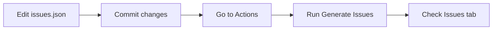
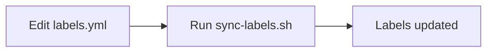
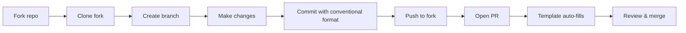

# BotHive GitHub Automation

This directory contains all GitHub-specific automation and configuration files.

## Directory Structure

```
.github/
├── issue-generator/          # Automated issue generation
│   ├── issues.json          # Issue definitions
│   ├── generate-issues.js   # Generation script
│   └── README.md            # Documentation
├── workflows/                # GitHub Actions workflows
│   └── generate-issues.yml  # Issue generation workflow
├── scripts/                  # Helper scripts
│   └── sync-labels.sh       # Label synchronization
├── ISSUE_TEMPLATE/          # Issue templates for contributors
│   ├── bug_report.yml       # Bug report template
│   └── feature_request.yml  # Feature request template
├── PULL_REQUEST_TEMPLATE.md # PR template
├── labels.yml               # Label definitions
└── README.md               # This file
```

## Quick Links

- **Generate Issues**: [Actions → Generate Issues](../actions/workflows/generate-issues.yml)
- **View Issues**: [Issues Tab](../issues)
- **View Labels**: [Labels Page](../labels)

## Components

### Issue Generator

Automated system for creating GitHub issues from JSON definitions.

**Files:**
- `issue-generator/issues.json` - 22 pre-defined issues
- `issue-generator/generate-issues.js` - Node.js script
- `issue-generator/README.md` - Detailed documentation

**Usage:**
1. Go to Actions tab
2. Select "Generate Issues" workflow
3. Run workflow with dry_run: false

**Local Testing:**
```bash
cd issue-generator
node generate-issues.js --dry-run
```

### Workflows

GitHub Actions workflows for automation.

**generate-issues.yml:**
- Trigger: Manual (workflow_dispatch)
- Purpose: Create issues from issues.json
- Permissions: issues:write, contents:read

**Future workflows (recommended):**
- `test.yml` - Run tests on PRs
- `build.yml` - Verify builds work
- `lint.yml` - Check code style

### Labels

Centralized label management system.

**File:** `labels.yml`

**Categories:**
- Core: hacktoberfest, good first issue, help wanted
- Type: bug, enhancement, documentation, security, etc.
- Category: accessibility, database, ci, monitoring, etc.
- Priority: priority:high, medium, low

**Syncing:**
```bash
cd scripts
./sync-labels.sh [--dry-run]
```

### Templates

Structured templates for issues and PRs.

**Issue Templates:**
- `bug_report.yml` - Bug reports with fields
- `feature_request.yml` - Feature requests with fields

**PR Template:**
- `PULL_REQUEST_TEMPLATE.md` - Standard PR format

## Workflows

### Creating Issues



### Syncing Labels



### Contributing



## Maintenance

### Adding New Issues

1. Edit `issue-generator/issues.json`
2. Follow the format:
   ```json
   {
     "title": "type(scope): description",
     "labels": ["label1", "label2", "hacktoberfest"],
     "body": "## Description\n\n..."
   }
   ```
3. Test locally: `node generate-issues.js --dry-run`
4. Run workflow to create

### Adding New Labels

1. Edit `labels.yml`
2. Add new label:
   ```yaml
   - name: new-label
     color: 'HEXCODE'
     description: 'Description here'
   ```
3. Run sync script:
   ```bash
   cd scripts
   ./sync-labels.sh
   ```

### Updating Templates

**Issue Templates:**
- Edit `.github/ISSUE_TEMPLATE/*.yml`
- Changes take effect immediately

**PR Template:**
- Edit `.github/PULL_REQUEST_TEMPLATE.md`
- Changes take effect immediately

## Best Practices

### Issue Titles

✅ **Good:**
- `feat(auth): add OAuth2 login flow`
- `fix(api): handle null responses`
- `docs(readme): add setup instructions`

❌ **Bad:**
- `Add feature`
- `Fix bug`
- `Update docs`

### Labels

- Use at least 2 labels per issue
- Always include `hacktoberfest` for Hacktoberfest issues
- Use `good first issue` for beginner tasks (< 2 hours)
- Use `help wanted` for complex tasks (> 2 hours)

### Issue Bodies

Include:
- Clear description with file references
- Impact explanation
- Actionable tasks (checkboxes)
- Acceptance criteria
- Code examples
- Time estimate

## Troubleshooting

### Issue Generation Fails

**Check:**
- GITHUB_TOKEN has correct permissions
- Repository has Issues enabled
- Workflow has write permissions
- issues.json is valid JSON

**Fix:**
```bash
# Validate JSON
cd issue-generator
node -e "JSON.parse(require('fs').readFileSync('issues.json', 'utf8'))"
```

### Labels Not Syncing

**Check:**
- GITHUB_TOKEN is set
- labels.yml is valid YAML
- github-label-sync is installed

**Fix:**
```bash
# Install tool
npm install -g github-label-sync

# Test locally
github-label-sync --help
```

### Templates Not Showing

**Check:**
- Files are in `.github/ISSUE_TEMPLATE/`
- YAML syntax is correct
- File extensions are `.yml` not `.yaml`

**Fix:**
- Rename files to use `.yml`
- Validate YAML syntax

## Configuration

### Workflow Permissions

Set in: **Settings → Actions → General → Workflow permissions**

Required:
- ✅ Read and write permissions
- ✅ Allow GitHub Actions to create and approve pull requests

### Branch Protection

Set in: **Settings → Branches**

Recommended for `main`:
- ✅ Require pull request before merging
- ✅ Require approvals (1+)
- ✅ Require status checks to pass
- ✅ Require branches to be up to date

## Resources

- [GitHub Actions Documentation](https://docs.github.com/actions)
- [Issue Templates Documentation](https://docs.github.com/communities/using-templates)
- [Labels Best Practices](https://docs.github.com/issues/using-labels)
- [Conventional Commits](https://www.conventionalcommits.org/)

## Support

For help with this automation:

1. Check [SETUP_GUIDE.md](../SETUP_GUIDE.md)
2. Check [CONTRIBUTING.md](../CONTRIBUTING.md)
3. Review workflow logs
4. Open an issue

## License

Same as parent repository.
